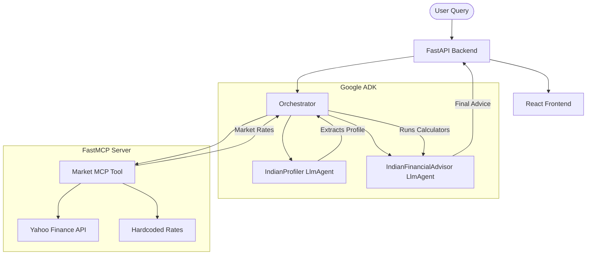

# FinPath India

An AI-driven financial advisory concierge agent tailored for the Indian market. Built using the Google Agent Development Kit (ADK), FastAPI, and React. 
Submitted for the Kaggle AI Agents: Intensive Vibe Coding Capstone Project.

## Project Track: Concierge Agents
FinPath India acts as an intelligent financial concierge. It ingests user financial profiles (in plain English or Hindi), interfaces with an MCP server to fetch real-time market data (Nifty 50, PPF, FD rates), runs financial projections (SIP, compound interest, debt payoff), and synthesizes a final recommendation.

## Architecture



## Kaggle Course Concepts Demonstrated

1. **Google ADK Integration**: Agents are defined using the official `LlmAgent` from `google-adk`.
2. **Model Context Protocol (MCP)**: Financial data retrieval is wrapped into a standardized MCP server using `FastMCP`.
3. **Security & Governance (The "Vibe Diff")**: The orchestrator pauses to generate a plain-English "Vibe Diff" (Execution Plan) before making its final recommendation, protecting against blind agent execution ("It works, ship it" fallacy).
4. **Zero Ambient Authority**: API routes are rate-limited via `SlowAPI` and schema payloads enforce strict string boundaries to combat prompt injections.
5. **Evaluation Harness**: Automated tests use the LLM-as-judge pattern to benchmark agent intent satisfaction.

## How to Run Locally

### Prerequisites
- Python 3.10+
- Node.js 18+
- Google Gemini API Key

### Backend Setup
1. Create a `.env` file in the root directory:
   ```
   GOOGLE_API_KEY=your_key_here
   ```
2. Install Python dependencies:
   ```bash
   pip install -r requirements.txt
   ```
3. Start the FastAPI server:
   ```bash
   uvicorn app.main:app --reload
   ```

### Frontend Setup
1. Navigate to the UI folder:
   ```bash
   cd finpath-ui
   ```
2. Install dependencies and run:
   ```bash
   npm install
   npm run dev
   ```

## Docker / Hugging Face Deployment
The app includes a multi-stage `Dockerfile` and `docker-compose.yml`.
To run the entire stack locally in a single container:
```bash
docker compose up --build
```
This configuration is specifically optimized for free 1-click deployment to **Hugging Face Spaces** (Docker environment).
