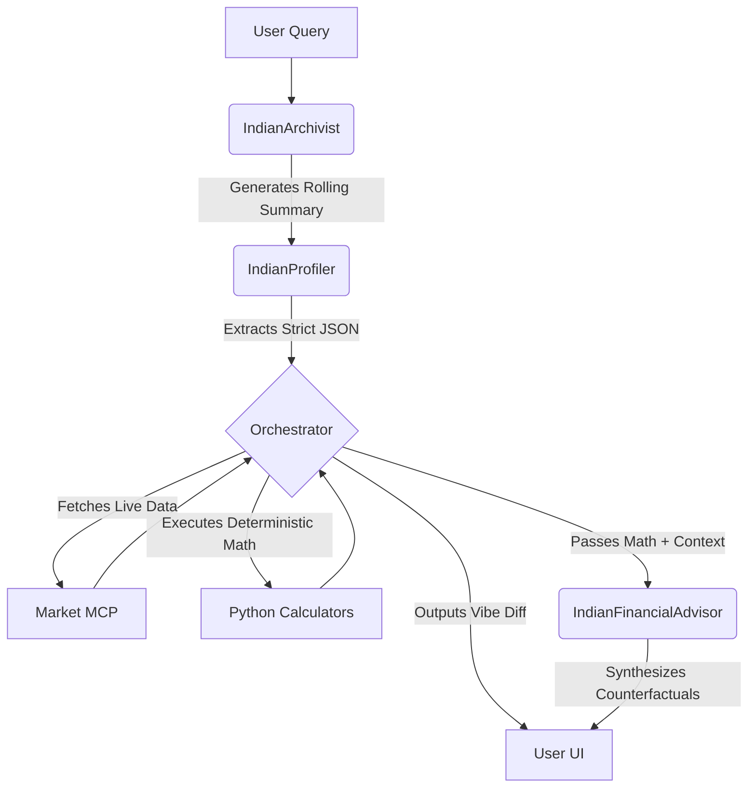

# FinPath India: A Counterfactual Decision Support Framework 🇮🇳

FinPath India is not just a financial calculator. It is a stateful, highly observable **Counterfactual Decision Support Engine**. 
The core purpose of this project is to help users explore "what if" scenarios (counterfactuals) and see the true long-term impact of their choices across different paths (e.g., paying off high-interest debt vs. investing in equity). As this framework evolves, this same agentic pattern can be applied to healthcare or education decision-making.

Unlike standard chatbots that suffer from "LLM Math" hallucinations, FinPath implements a strict **Agentic Workflow** using the Google Agent Development Kit (ADK). It separates probabilistic language generation from deterministic math execution, ensuring 100% accurate calculations while the AI handles reasoning and synthesis.

## 🌟 Key Enterprise Features

* **Context Engineering (Rolling Summary Memory):** Uses a background `IndianArchivist` agent to distill chat history into a structured user profile, enabling fast, token-efficient follow-up questions without "context rot."
* **Zero Ambient Authority (Vibe Diff):** Surfaces an internal Execution Plan to the user *before* rendering advice, ensuring transparency in what data was extracted and which tools were called.
* **Observability (Logs & Traces):** Implements a `ProductionLogger` emitting structured JSON logs for every agent thought, tool call, and latency metric.
* **Agent Quality Flywheel:** Captures real-world user feedback (👍/👎) directly tied to specific Observability Trace IDs for continuous improvement.
* **Agent-as-a-Judge Evaluation:** Uses a secondary LLM to evaluate the internal *process trace* (Process Evaluation) rather than just the final text output.

---

## 🏗️ Architecture Flow



---

## 💻 Local Setup & Installation

### Prerequisites
- Python 3.10+
- Node.js & npm
- A Google Gemini API Key

### 1. Clone and Setup Backend
```bash
git clone https://github.com/YOUR_USERNAME/finpath-india.git
cd finpath-india

# Create virtual environment
python -m venv venv
source venv/bin/activate  # On Windows: venv\Scripts\activate

# Install dependencies
pip install -r requirements.txt

# Set your API Key
export GOOGLE_API_KEY="your_api_key_here"  # On Windows: set GOOGLE_API_KEY="your_api_key_here"
```

### 2. Setup Frontend
```bash
cd finpath-ui
npm install
npm run build
cd ..
```

### 3. Run the Server
```bash
uvicorn app.main:app --host 0.0.0.0 --port 8000
```
Open `http://127.0.0.1:8000` in your browser. Note: Structured Observability logs will stream directly to this terminal.

---

## 🚀 Deployment (Hugging Face Spaces / Docker)

This application is fully containerized and designed for zero-config deployment on Hugging Face Spaces (Docker).

1. Create a new **Docker** Space on Hugging Face.
2. In the Space Settings, add your `GOOGLE_API_KEY` as a Secret.
3. Push this repository directly to the Hugging Face Space using Git, or upload the files via the UI.
4. The included `Dockerfile` will automatically build the React frontend, install Python dependencies, and expose the FastAPI server on port `7860`.

```dockerfile
# The Dockerfile automatically handles:
# 1. Building the Vite React App
# 2. Installing Python requirements
# 3. Running Uvicorn on port 7860
```

---
*Disclaimer: This project was built for educational purposes to demonstrate agentic architectures. AI-generated financial scenarios are for demonstration only and should not be considered professional financial advice.*
